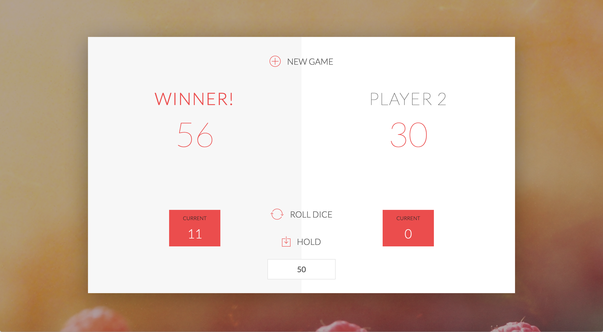

# Dice Game 🎲

[](https://opensource.org/licenses/MIT) [](https://GitHub.com/Naereen/StrapDown.js/graphs/contributors/) [](https://github.com/ellerbrock/open-source-badges/) [](https://saythanks.io/to/kennethreitz)


## Demo



### NEW GAME RULES:

1. A player looses his ENTIRE score when he rolls ```two 6``` in a row. After that, it's the next player's turn. (Hint: Always save the previous dice roll in a separate variable)
2. Now there is a ```FINAL score input field``` where players can set the winning score, so that they can change the ```predefined score of 100```. 
3. Now there are two dices in a game.

----------


### GAME RULES:

1. The game has ```2 players```, playing in rounds
2. In each turn, a player rolls a dice as many times as he whishes. Each result get added to his ```ROUND score```
3. BUT, if the player rolls a ```1```, all his ROUND score gets **lost**. After that, it's the next player's turn
4. The player can choose to ```'Hold'```, which means that his ROUND score gets added to his ```GLOBAL score```. After that, it's the next player's turn
5. The first player to reach ```100 points on GLOBAL score``` **wins the game**

#### Enjoy and Good Luck! 😀


